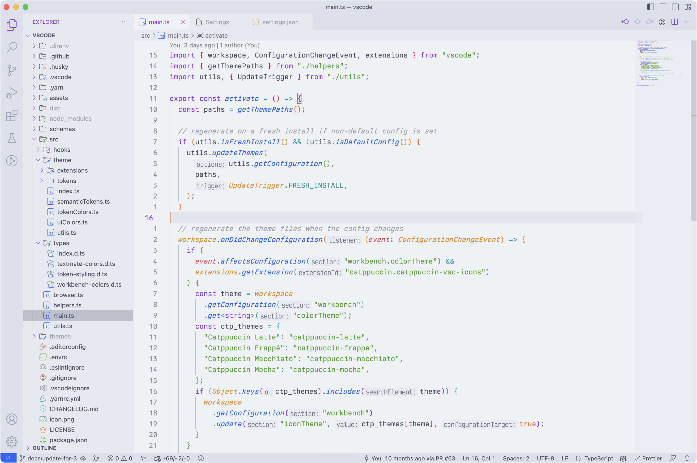
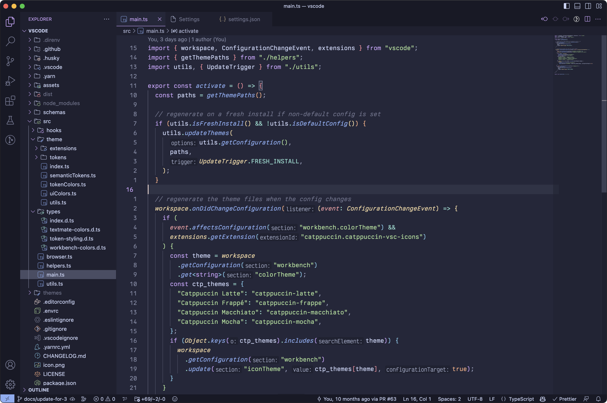

<h3 align="center">
	<br/>
	
	Catppuccin for <a href="https://code.visualstudio.com">VSCode</a>
	
</h3>

<p align="center">
    <a href="https://github.com/catppuccin/vscode/stargazers"></a>
    <a href="https://github.com/catppuccin/vscode/issues"></a>
    <a href="https://github.com/catppuccin/vscode/contributors"></a>
</p>

<p align="center">
  
</p>

> **Note**\
> We just released a complete rewrite of our **Syntax Highlighting**.\
> If a language you use now lacks syntax highlighting, please report it in [an issue](https://github.com/catppuccin/vscode/issues/new/choose)!

## Previews

<details>
<summary>🌻 Latte</summary>

</details>
<details>
<summary>🪴 Frappé</summary>

</details>
<details>
<summary>🌺 Macchiato</summary>

</details>
<details>
<summary>🌿 Mocha</summary>

</details>

## Usage

**Preferred method of installation**

Install the extension from a Marketplace:

- [Visual Studio Marketplace](https://marketplace.visualstudio.com/items?itemName=Catppuccin.catppuccin-vsc)
- [Open-VSX](https://open-vsx.org/extension/Catppuccin/catppuccin-vsc)

**Manual method for installation**

Download the VSIX from
[the latest GitHub release](https://github.com/catppuccin/vscode/releases/latest).
Open the Command Palette, and select "Extensions: Install from VSIX...", then
open the file you just downloaded.

> **Note**\
> It is recommended to change `window.titleBarStyle` to `custom` in your JSON user settings.

**Using the JSON theme only**

You can find the compiled theme JSON files (with default settings as documented below) on the [compiled branch](https://github.com/catppuccin/vscode/tree/compiled).

## Customization

> **Note**\
> We also have a [Catppuccin Icon Pack](https://marketplace.visualstudio.com/items?itemName=Catppuccin.catppuccin-vsc-icons)!

Catppuccin for VSCode can be customized to your liking. If you like the Catppuccin colors, but feel that they are a bit too bright for working at night, customization got you covered!


<details>
<summary>⚙️ Used settings</summary>
<p>

```json5
     // use Mocha as the base
    "workbench.colorTheme": "Catppuccin Mocha",
    // pink as the accent color
    "catppuccin.accentColor": "pink",
    // make Mocha specifically very dark
    // (this preserves other flavours!)
    "catppuccin.colorOverrides": {
        "mocha": {
            "base": "#000000",
            "mantle": "#010101",
            "crust": "#020202",
        }
    },
    // use your accent (pink) on the statusBar as well
    "catppuccin.customUIColors": {
        "mocha": {
            "statusBar.foreground": "accent"
        }
    },
```

</p>
</details>

Open your settings, and look for `Extensions > Catppuccin`. Available options are documented here.

### Custom accent color

`catppuccin.accentColor`

You can choose any color as your "accent" color. `mauve` is our default, but you can add more personality by using your favorite!

### Disable italics & bold fonts

You can toggle whether to use

- italics for keywords: `catppuccin.italicKeywords`
- italics for comments: `catppuccin.italicComments`
- bold for keywords: `catppuccin.boldKeywords`

### Flat appearance

`catppuccin.workbenchMode`

By default, Catppuccin for VSCode uses 3 shades of our `base` color for the workbench.
For example in Mocha:

- `base: #1e1e2e` - the editor background
- `mantle: #181825` - the sidebar
- `crust: #11111b` - the activity bar, status bar and title bar

If you'd like a more flat look, you can change it to `flat`! This only uses `base` and `mantle`, reducing it to 2 shades:

- `base: #1e1e2e` - the editor background
- `mantle: #181825` - the sidebar, the activity bar, status bar and title bar

<details>
<summary>📸 Preview</summary>


</details>

### Paired Brackets

`catppuccin.bracketMode`

By default, we're using `red`, `peach`, `yellow`, `green`, `blue`, and `mauve` for matching bracket pairs. You can change that option, if you want different colors:

- `rainbow` is our default setting, using the colors described above.
- `dimmed` uses the same rainbow colors, but muted by 20%.
- `monochromatic` only uses grayish colors, from `subtext1` to `surface2`.
- `neovim` uses the same colors that [`nvim-ts-rainbow`](https://github.com/p00f/nvim-ts-rainbow) uses in our [Neovim port](https://github.com/catppuccin/nvim).

### Override palette colors

`catppuccin.colorOverrides`

Colors can be overwritten in the JSON user settings, like so:

```json5
    // ...your other settings...
    "catppuccin.colorOverrides": {
        // make text red red all flavours
        "all": {
            "text": "#ff0000"
        },
        // make Mocha "OLEDppuccin" - use black editor background
        "mocha": {
            "base": "#000000",
            "mantle": "#010101",
            "crust": "#020202",
        }
    }
```

### Use palette colors on workbench elements (UI)

`catppuccin.customUIColors`

If you want to customize where certain palette colors appear, you can change it like so:

```json5
    "catppuccin.customUIColors": {
        // make the breadcrumb "text" on "overlay0" for all flavours
        "all": {
            "breadcrumb.background": "overlay0",
            "breadcrumb.foreground": "text",
        },
        // but for mocha, use "crust" on your currently selected accent.
        "mocha": {
            // "accent" selects your current accent color.
            "breadcrumb.background": "accent",
            "breadcrumb.foreground": "crust",
            // you can use opacity, by specifing it after a space
            // "rosewater 0.5" would mean 50% opacity, here it's 20%
            "minimap.background": "rosewater 0.2"
        }
    },
```

You can find all the available keys [here](https://code.visualstudio.com/api/references/theme-color).

> **Note**: This respects your [color overrides](#override-palette-colors).

## Support

If you have any questions regarding this port, feel free to [open an issue](https://github.com/catppuccin/vscode/issues), or ask in [our Discord](https://discord.catppuccin.com), where have a [dedicated forum](https://discord.com/channels/907385605422448742/1020275848940626002/1036777622941736990) for support.

## Development

1. Clone and open this repository in VSCode.
2. Launch a new instance from "Run and Debug". This will spawn a new instance, which will have the current build of the Theme available.
3. Make modifications to the JSONs in `./themes` to see the changes immediately.
4. To preserve changes, they have to be edited in `./src/theme/*.ts`, since the theme builds the JSONs from there.

## 💝 Thanks to

- [VictorTennekes](https://github.com/VictorTennekes)
- [Gingeh](https://github.com/Gingeh)
- [BrunDerSchwarzmagier](https://github.com/BrunDerSchwarzmagier)
- [ghostx31](https://github.com/ghostx31)
- [Ren](https://github.com/watatomo)
- [Hamothy](https://github.com/sgoudham)

&nbsp;

<p align="center"></p>
<p align="center">Copyright &copy; 2021-present <a href="https://github.com/catppuccin" target="_blank">Catppuccin Org</a>
<p align="center"><a href="https://github.com/catppuccin/catppuccin/blob/main/LICENSE"></a></p>
